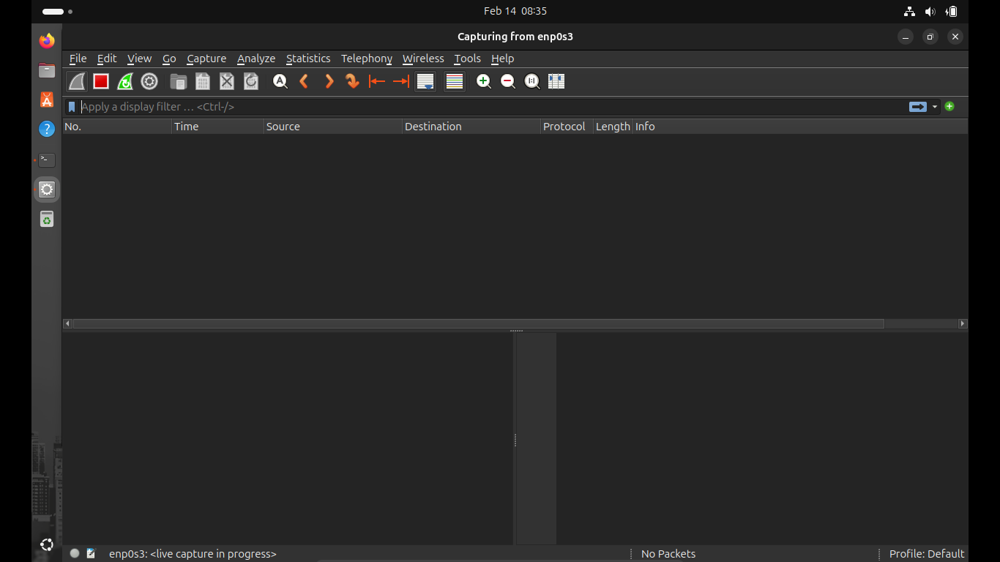

📌Laporan Praktikum 3 Jaringan Komputer

Nama : M. Rizky Taufik Nur Hidayat

NIM  : 09030582327076

Kelas: TK4B

<h1>Tracker data Qos wifi dengan WireShark</h1>

<ol>
<li>Download wireshark dengan komen sudo apt install wireshark di terminal</li>

<li>buka wireshark dengan komen sudo wireshar</li>

<li>Pilih jaringan yang ingin di track lalu klik start di pojok kiri atas</li>

<li>maka tracking sudah di mulai</li>

<li>Buka browser dan pilih apa yang mau di track, misal youtube  
Lalu scroll atau apapun selama 10 menit</li>

<li>maka hasil tracking sudah tertangkap</li>

<li>filter hasil dari track untuk mencari http</li>

<li>filter hasil dari track untuk mencari tcp</li>

<li>Hasil dari filter tadi di save as ke format csv untuk di olah di excel</li>

<li>Pilih bagian menu statistic, lalu capture file properties </li>

<li>Disini terlihat data total capture, time span, packet loss, dan jumlah byte </li>

<li>Install libreoffice pengganti excel di linux ubuntu dengan komen sudo apt install libreoffice</li>

<li>Open app dengan komen di terminal</li>

<li>Olah data dengan membuat Time 1, Time 2, Delay 1, dan Delay 2 untuk menghitung  
Tiem 1 dan Time 2 untuk menghitung Delay, Sedangkan Delay 1 dan Delay 2 untuk menghitung jitter</li>

<li>maka hasil adalah sebagai berikut</li>

<li>Berikut total dan hasil perhitungan dari ThroughPut, Packet Loss, Delay, dan Jitter</li>

